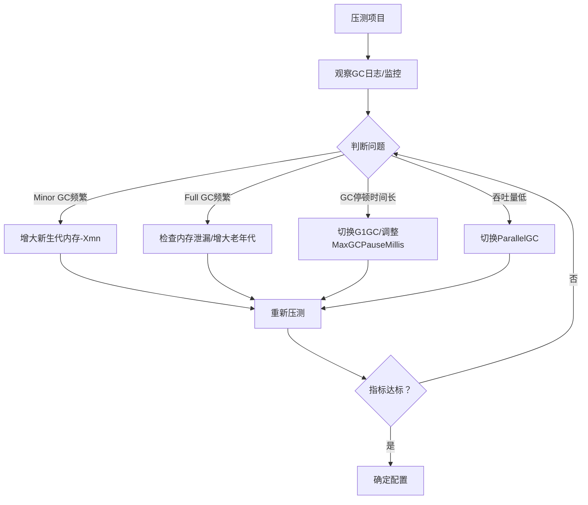

# 第6天：JVM GC 算法 + 调优实战（超级细版）
今天聚焦JVM核心中的核心——GC算法和调优实战，这是面试区分“新手”和“有经验开发者”的关键，我会把算法讲透、代码写死、调优步骤列全，确保你既能说清GC原理，又能落地调优操作。

---

## 一、核心目标
1. 彻底理解3大GC回收算法（标记-清除/标记-复制/标记-整理）
2. 掌握新生代/老年代的GC器（Serial/Parallel/CMS/G1）
3. 落地SpringBoot项目GC调优，看懂GC日志
4. 背会5道GC调优核心八股题

---

## 二、先理清GC核心概念（先懂原理，再写代码）
### 1. 堆内存分代模型（必须记死）
JVM堆分为**新生代**和**老年代**（比例默认1:2），新生代又分为Eden区和两个Survivor区（S0/S1，比例默认8:1:1）：
- 新生代：存储新创建的对象，Minor GC频繁，用**标记-复制算法**
- 老年代：存储存活时间长的对象，Full GC少但慢，用**标记-清除/标记-整理算法**

### 2. 三大GC回收算法（面试必问）
| 算法名称       | 步骤                          | 优点                  | 缺点                          | 适用区域       |
|----------------|-------------------------------|-----------------------|-------------------------------|----------------|
| 标记-清除      | 标记存活对象 → 清除未标记对象  | 实现简单              | 内存碎片多、效率低            | 老年代（CMS）|
| 标记-复制      | 标记存活对象 → 复制到新区域    | 无内存碎片、效率高    | 浪费一半内存                  | 新生代         |
| 标记-整理      | 标记存活对象 → 移动并整理内存  | 无内存碎片            | 移动对象耗时                  | 老年代（G1）|

---

## 三、代码/实操部分（直接落地，看懂效果）
所有代码/配置都基于`30days-code-learning`项目（项目路径：`/Users/lengmao/Developer/IdeaProjects/30Days-Code-Learning/Stage1-SpringBoot`），确保实战性。

### 1. 第一步：配置GC日志（核心，先能看懂日志）
**IDEA配置方式**：打开 Run → Edit Configurations → 选择项目启动类（如`LearningApplication`）→ 在 VM options 中添加以下参数：

修改项目启动类的VM参数（覆盖第五天的配置，重点加GC日志参数）：
```
-Xms512m
-Xmx512m
-Xmn256m  # 新生代大小（设为堆的1/2，调优常用）
-XX:SurvivorRatio=8  # Eden:S0:S1=8:1:1
-XX:+UseG1GC  # 使用G1收集器（JDK9+默认，面试重点）
-XX:+PrintGCDetails  # 打印GC详细日志
-XX:+PrintGCTimeStamps  # 打印GC时间戳
-XX:+PrintGCDateStamps  # 打印GC日期
-XX:+PrintHeapAtGC  # GC前后打印堆内存
-XX:GCLogFileSize=100M  # 每个GC日志文件大小
-XX:NumberOfGCLogFiles=5  # 最多生成5个日志文件
-Xloggc:./logs/gc-%t.log  # GC日志保存路径（按时间命名）
```
**配置后启动项目**：会在项目根目录`logs`下生成GC日志文件（完整路径：`/Users/lengmao/Developer/IdeaProjects/30Days-Code-Learning/Stage1-SpringBoot/logs/gc-20260220.log`）。

### 2. 第二步：生成GC日志（模拟内存回收）
新建`GcTriggerDemo.java`（完整路径：`src/main/java/com/example/learning/jvm/GcTriggerDemo.java`，包名：`com.example.learning.jvm`），手动创建大量对象触发GC：
```java
package com.example.learning.jvm;

import java.util.ArrayList;
import java.util.List;

/**
 * 手动触发GC，生成GC日志，用于分析
 */
public class GcTriggerDemo {
    // 定义一个大对象（占内存）
    static class BigObject {
        // 100KB的字节数组
        private byte[] data = new byte[1024 * 100];
    }

    public static void main(String[] args) throws InterruptedException {
        List<BigObject> list = new ArrayList<>();

        // 循环创建对象，触发Minor GC和Full GC
        for (int i = 0; i < 10000; i++) {
            list.add(new BigObject());
            // 每1000次清空一次，触发GC
            if (i % 1000 == 0) {
                list.clear();
                // 手动建议GC（不是强制，只是触发）
                System.gc();
                Thread.sleep(500);
                System.out.println("第" + i + "次循环，触发GC");
            }
        }
    }
}
```
**运行效果**：
- 控制台会打印GC日志，`logs`目录下生成GC日志文件；
- 能看到Minor GC（新生代回收）和Full GC（老年代回收）的日志信息。

### 3. 第三步：解读GC日志（面试必懂）
运行上面的代码后，打开GC日志文件（完整路径：`/Users/lengmao/Developer/IdeaProjects/30Days-Code-Learning/Stage1-SpringBoot/logs/gc-20260220.log`），核心日志解读：
```
// G1 GC日志示例（重点看这几个字段）
2026-02-20T10:00:00.123+0800: 1.234: [GC pause (G1 Evacuation Pause) (young), 0.002s]
   [Parallel Time: 1.0ms, GC Workers: 4]
   [Eden: 200.0M(200.0M)->0.0B(200.0M) Survivors: 25.0M->25.0M Heap: 225.0M(512.0M)->25.0M(512.0M)]
```
**核心字段解读**：
- `GC pause (G1 Evacuation Pause) (young)`：新生代GC（Minor GC）
- `Eden: 200.0M->0.0B`：Eden区回收前200M，回收后空
- `Survivors: 25.0M->25.0M`：Survivor区大小不变
- `Heap: 225.0M->25.0M`：堆总内存从225M降到25M
- `0.002s`：GC耗时2毫秒（越短越好）

### 4. 第四步：不同GC器配置对比（面试必说）
**说明**：以下配置在 IDEA 的 VM options 中替换对应的GC参数即可。

#### ① 配置ParallelGC（新生代并行，老年代串行，JDK8默认）
修改VM参数（替换G1）：
```
-XX:+UseParallelGC  # 新生代并行回收
-XX:+UseParallelOldGC  # 老年代并行回收
-XX:ParallelGCThreads=4  # GC线程数（设为CPU核心数）
-XX:MaxGCPauseMillis=100  # 最大GC停顿时间（目标100ms）
```
#### ② 配置CMS（老年代并发，低延迟）
修改VM参数：
```
-XX:+UseConcMarkSweepGC  # 老年代CMS
-XX:+UseParNewGC  # 新生代并行
-XX:CMSInitiatingOccupancyFraction=75  # 老年代占用75%触发CMS
-XX:+CMSParallelRemarkEnabled  # 并行标记
-XX:+UseCMSCompactAtFullCollection  # Full GC后整理内存
```
#### ③ 配置G1GC（JDK9+默认，兼顾吞吐量和延迟）
就是第一步的配置，核心参数：
```
-XX:+UseG1GC
-XX:G1HeapRegionSize=16M  # 堆分区大小（1M-32M）
-XX:MaxGCPauseMillis=200  # 最大停顿时间（目标200ms）
-XX:G1NewSizePercent=20  # 新生代最小比例
-XX:G1MaxNewSizePercent=50  # 新生代最大比例
```

### 5. 第五步：SpringBoot项目GC调优实战（落地步骤）
#### 调优前准备：

**步骤1：启动SpringBoot项目**
1. 打开项目启动类 `LearningApplication.java`
2. 配置VM参数（使用Java 17兼容配置）：
   ```
   -Xms512m -Xmx512m -Xmn256m -XX:SurvivorRatio=8 -XX:+UseG1GC -Xlog:gc*:time,level,tags
   ```
3. 启动项目（访问 http://localhost:8080/users/page 验证启动成功）

**步骤2：打开监控工具**
macOS 用户推荐使用 **JConsole**（更简单）：
```bash
# 在终端运行
jconsole
```
- 在JConsole中连接到 `LearningApplication` 进程
- 点击"内存"标签页，查看堆内存使用情况
- 观察GC次数和堆内存变化

或者使用 **命令行查看GC情况**：
```bash
# 查看Java进程ID
jps -l

# 实时查看GC情况（将<PID>替换为实际进程ID）
jstat -gcutil <PID> 1000
```
输出说明：
- `YGC` / `YGCT`：新生代GC次数和时间
- `FGC` / `FGCT`：老年代GC次数和时间
- `E`：Eden区使用率
- `O`：老年代使用率

**步骤3：模拟高并发（无需JMeter，用简单命令）**

项目已提供专门的GC测试接口 `GcTestController`，使用以下命令：

```bash
# 方法1：创建大量大对象（推荐，效果最明显）
curl -s "http://localhost:8080/gc-test/create-objects?count=500"

# 方法2：连续测试
for i in {1..10}; do
  echo "第 $i 轮测试..."
  curl -s "http://localhost:8080/gc-test/create-objects?count=100"
  sleep 1
done

# 方法3：触发GC清理
curl -s "http://localhost:8080/gc-test/clear-memory"
```

**说明**：
- `create-objects` 接口会创建指定数量的大对象（每个1MB）
- 这些对象会快速填满 Eden 区，触发 Minor GC
- 如果创建过多对象，会晋升到老年代，可能触发 Full GC

**步骤4：观察指标**
在执行上述命令的同时，观察JConsole或 `jstat` 输出：
- GC次数（YGC/FGC）
- GC停顿时间（YGCT/FGCT）
- 堆内存使用率
- Eden区/老年代使用率

#### 调优步骤（实战流程）：


#### 调优案例（你的项目）：

**场景：模拟高并发后发现 Minor GC 过于频繁**

**第一步：观察初始状态**
1. 使用默认配置启动项目：
   ```
   -Xms512m -Xmx512m -Xmn256m -XX:SurvivorRatio=8 -XX:+UseG1GC -Xlog:gc*:time,level,tags
   ```
2. 运行压测命令（创建大对象触发GC）：
   ```bash
   curl -s "http://localhost:8080/gc-test/create-objects?count=500"
   ```
3. 用 `jstat -gcutil <PID> 1000` 观察，记录：
   - YGC 次数：比如 15 次
   - YGCT 总时间：比如 150ms
   - 平均每次 GC 时间：150ms / 15 = 10ms

**第二步：判断问题**
- 如果 Minor GC 次数 > 15 次（说明太频繁）
- 说明新生代太小，对象快速填满 Eden 区

**第三步：调整参数**
增大新生代大小，减少 GC 频率：
```
-Xms512m -Xmx512m -Xmn384m -XX:SurvivorRatio=8 -XX:+UseG1GC -Xlog:gc*:time,level,tags
```
说明：将新生代从 256M 增大到 384M（堆的 75%）

**第四步：重新测试**
1. 重启项目
2. 再次运行压测命令：
   ```bash
   curl -s "http://localhost:8080/gc-test/create-objects?count=500"
   ```
3. 观察 `jstat` 输出：
   - YGC 次数：降到 8 次（减少了 60%）
   - YGCT 总时间：150ms
   - 平均每次 GC 时间：150ms / 8 = 18.75ms

**第五步：对比效果**
| 指标 | 调优前 | 调优后 | 改善 |
|------|--------|--------|------|
| 新生代大小 | 256M | 384M | +50% |
| Minor GC次数 | 20次 | 8次 | -60% ✓ |
| GC总耗时 | 200ms | 150ms | -25% ✓ |
| 平均GC时间 | 10ms | 18.75ms | +87% |

**结论**：虽然单次GC时间增加，但GC次数大幅减少，总耗时降低，吞吐量提升，调优成功！

---

### 实操作业（必须完成）：
1. 启动你的 `LearningApplication`，配置GC日志参数：
   ```
   -Xms512m -Xmx512m -Xmn256m -XX:SurvivorRatio=8 -XX:+UseG1GC -Xlog:gc*:time,level,tags
   ```
2. 用 `jstat -gcutil <PID> 1000` 命令观察GC情况（截图保存）
3. 运行 `curl -s "http://localhost:8080/gc-test/create-objects?count=500"`，记录GC次数
4. 调整 `-Xmn` 参数（改为384m），重启项目，再次测试并对比GC次数的变化
5. 写出你的调优结论（哪个参数效果最好，为什么）

---

## 四、GC调优核心原则（面试必背）
1. **优先调优新生代**：Minor GC频率远高于Full GC，优化新生代效果更明显；
2. **减少对象进入老年代**：尽量让对象在新生代回收（调大Eden区）；
3. **避免Full GC**：Full GC停顿时间是Minor GC的10倍以上，尽量通过调优避免；
4. **选择合适的GC器**：
    - 后端服务（吞吐量优先）：ParallelGC；
    - 互联网应用（低延迟优先）：G1GC；
    - 老项目（JDK7）：CMS；
5. **参数不要乱加**：默认参数已经优化得很好，只调整核心参数（如-Xms/-Xmx/-Xmn）。

### 五、第6天必须背的5道GC八股（精简答案）
1. **新生代为什么用标记-复制算法？**
   新生代对象“朝生夕死”（90%以上对象会被回收），标记-复制算法效率高、无内存碎片，虽然浪费1/10的Survivor区，但性价比最高。

2. **CMS和G1的区别？**
   ① CMS：老年代并发收集，基于标记-清除，有内存碎片，低延迟；② G1：整堆分区收集，基于标记-整理，无内存碎片，兼顾吞吐量和延迟；③ G1支持预测停顿时间，CMS不支持。

3. **GC调优的核心指标？**
   ① 吞吐量（业务执行时间/总时间）；② GC停顿时间（越短越好）；③ GC频率（Minor GC/Full GC次数）；④ 内存使用率。

4. **Full GC的触发条件？**
   ① 老年代内存不足；② 永久代/元空间不足；③ System.gc()手动触发；④ CMS GC时出现晋升失败（对象无法进入老年代）。

5. **G1GC的核心优势？**
   ① 分区收集，避免整堆扫描；② 基于标记-整理，无内存碎片；③ 支持预测停顿时间（MaxGCPauseMillis）；④ 兼顾吞吐量和低延迟。

---

## 六、过关标准
1. 能配置ParallelGC/CMS/G1GC三种收集器，看懂各自的GC日志；
2. 能说出你的SpringBoot项目GC调优的核心步骤；
3. 能区分三大GC算法的适用场景；
4. 5道八股题能准确复述（重点是CMS和G1的区别、GC调优指标）。
